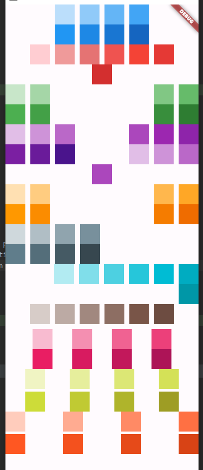

# Flutter Extended Wrap

## Install

### pubspec.yaml

Update pubspec.yaml and add the following line to your dependencies.

```yaml
dependencies:
  flutter_extended_wrap: ^0.0.1
```

## Import

Import the package with :

```dart
import 'package:flutter_extended_wrap/flutter_extended_wrap.dart';
```

## Features

With the extended Wrap you can automatically make a default Flutter Wrap expand to its parent size and then you can 
specify how many children a Wrap should put on each run. Additionally you have some options to customize where the free 
space is put like for example placing the children on both sides with the free space in the center of the Wrap. 

### Classes

```dart
class ExtendedWrap {/*...*/}
class ExtendedWrapAlignment {/*...*/}
```

## Usage

You can find an example on how to use different configurations of the expanded Wrap inside of the `/example` folder 
which displays the following: 



## Changelog

[CHANGELOG.md](CHANGELOG.md)

## Copyright and license

MIT License

Copyright (c) 2023 Nikoo00o

Permission is hereby granted, free of charge, to any person obtaining a copy
of this software and associated documentation files (the "Software"), to deal
in the Software without restriction, including without limitation the rights
to use, copy, modify, merge, publish, distribute, sublicense, and/or sell
copies of the Software, and to permit persons to whom the Software is
furnished to do so, subject to the following conditions:

The above copyright notice and this permission notice shall be included in all
copies or substantial portions of the Software.

THE SOFTWARE IS PROVIDED "AS IS", WITHOUT WARRANTY OF ANY KIND, EXPRESS OR
IMPLIED, INCLUDING BUT NOT LIMITED TO THE WARRANTIES OF MERCHANTABILITY,
FITNESS FOR A PARTICULAR PURPOSE AND NONINFRINGEMENT. IN NO EVENT SHALL THE
AUTHORS OR COPYRIGHT HOLDERS BE LIABLE FOR ANY CLAIM, DAMAGES OR OTHER
LIABILITY, WHETHER IN AN ACTION OF CONTRACT, TORT OR OTHERWISE, ARISING FROM,
OUT OF OR IN CONNECTION WITH THE SOFTWARE OR THE USE OR OTHER DEALINGS IN THE
SOFTWARE.
